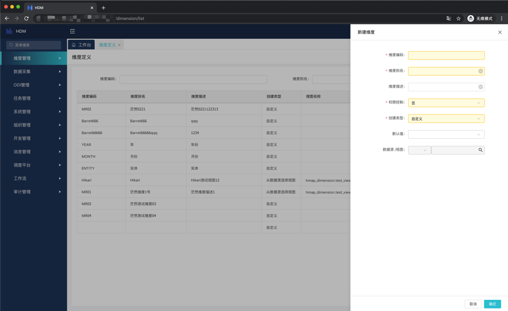
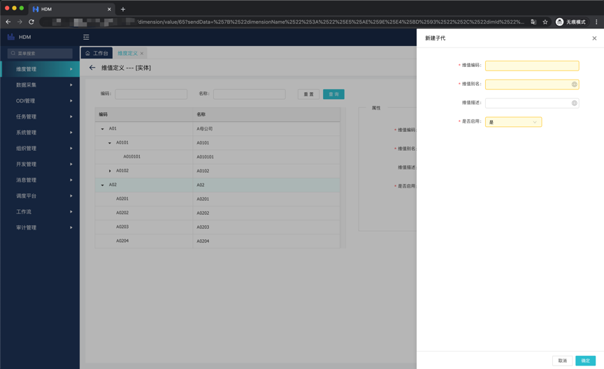
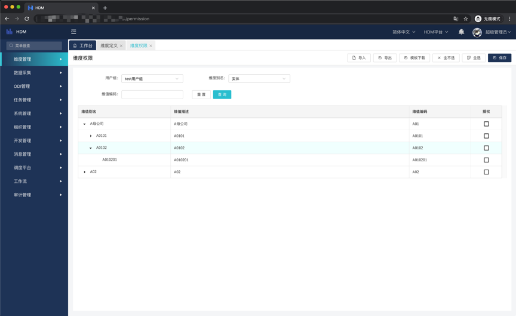
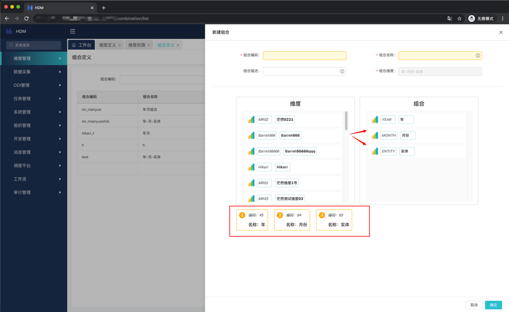
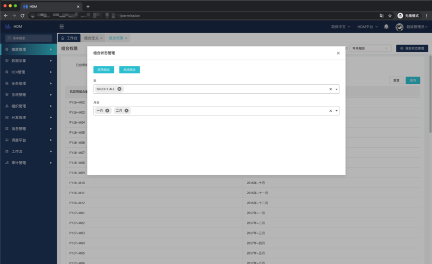

# 维度定义&维值定义

## 概述

&emsp;&emsp;`HDM`新版的维度概念整体和原`HDM`维度概念不变，均是以平面数据、伪多维的形式存储和显示数据，方便企业在不同的维度进行数据切换。故处于此目的，我们将维度的一小部分剥离了出来，即“值集”。维度作为数据维度的概念，狭义上就是承担数据表单的表头，广义上就是数据按照维度维值的区域划分。其余的键值对由值集来承担，这部分本应是值集的责任，在新版`HDM`中体现，具体可以参考“5.4值集管理”。

## 维度定义

> 入口: 维度管理-维度定义

&emsp;&emsp;新建有两种方式，一种是直接点击右上方的导入，导入请参考常见系统数据导入。另一种是点击右上角的新建，输入必输信息即可完成新建，如下图:

~~~
维度编码: 在同一租户下唯一，只能输入字母、数字、下划线
维度别名: 当前维度的别名，右边的小地球图标即为多语言，维护了即可切换语言环境后看到维护后的内容，本文档下边不再赘述。
维度描述: 当前维度的描述，支持多语言。
权限控制: 是/否，表明此维度是否需要权限控制(注意，此选项只能在初始化的时候选择一次，不能切换)
创建类型: 自定义/从数据源选择视图，自定义即通过手动录入、导入的形式完成维度创建、更新。选择视图的方式只支持维值的查询，不支持新增、修改等DML，视图如何创建请参考常见系统表创建。
默认值: 非必选，创建维值后可以选择，可以达到模板的组合上默认显示此条(有权限或不受权限控制)的效果。
数据库/视图: 如果创建类型为视图，则必选。选择维护好的数据源后，即可选择对应的视图。
~~~

## 维值定义(自定义)

> 入口: 维度管理-维度定义-操作-维值

&emsp;&emsp;以下功能仅提供给自定义方式创建的维度。进入刚初始化好的维度后，仅有新建按钮可用，新建后输入必填内容即可创建顶层维值，当然也可以理解为第一个维值，因为可以继续新建子代和同级。跟原`HDM`不一样的是，我们引入了层级的概念，即维值可以拥有层级。你可以把它当做一棵树亦或是一个集合，创建和效果如下图:

~~~
维值编码: 在同一维度下唯一，只能输入字母、数据、下划线、横杠，例如: A01_ERP-A
维值别名: 当前维值的别名。
维值描述: 当前维值的描述。
是否启用: 是/否，选择是的话当前维值才能被赋权和使用，否则仅仅是被创建，无法使用，此功能可快速失效调某一类组合。
~~~

# 维度权限

## 概述

&emsp;&emsp;维度权限用于控制维值在用户组中的权限，用户的权限最终取所有权限的并集。快速创建也可以通过导入实现。

## 维值授权

> 入口: 维度管理-维度权限

&emsp;&emsp;选择维度和用户组后，点击授权后保存即可，为了提供便捷，可以全选/全不选，选择父层后，后代自动选中。如下图:

# 组合管理

## 概述

&emsp;&emsp;组合定义了多个维度的集合，用于控制权限和实现数据展示、隔离。仅有开启的组合数据才能被编辑，否则所有人均无权操作当前组合下的数据。

## 组合定义

> 入口: 维度管理-组合管理-组合定义

&emsp;&emsp;可以通过导入和新建的方式创建。新建后输入必填内容和维度的拖拽后即可完成创建，如下图:

~~~
组合编码: 同一租户下唯一，只能输入字母、数字、下划线
组合名称: 当前组合的名称
组合描述: 当前组合的描述
组合维度: 拖拽后自动生成，手动拖拽维度到右方生成组合，上下即为组合的顺序。注意: 初始化一次保存后不能再更改。
~~~

## 组合权限

> 入口: 维度管理-组合管理-组合权限

&emsp;&emsp;在右上角下拉框中选择组合，然后点击组合状态管理打开弹窗，然后选择打算开启的维值即可。由于开启组合的底层是数据的笛卡尔积，所以我们采用异步的方式，即开启后即返回成功提交到任务台，真正开启结束后会在右上角的铃铛处提示，可以在任务台查看相关信息，具体任务台请参考任务台模块。开启组合如下图:

# 值集管理

## 概述

&emsp;&emsp;值集是键值对的集合，原`HDM`中对值集和维度的概念较为混淆，这里单独把值集拿出来，值集可以用作模板下拉框一些选择值，也可以用作一些`key-value`的数据存储的前台展示，值集的创建方式有很多种: 自定义、从维度复制当前、从维度复制实时更新和视图的方式。作用是解耦和维度的强关联，更体现出`key-value`的概念。

## 新建值集

> 入口: 维度管理-值集管理

&emsp;&emsp;值集的创建方式有两种，一种是导入，一种是通过新建按钮，不过导入的值集只能使用自定义方式创建，如果需要定义复制和实时更新的，请使用新建按钮创建维值。

~~~
值集编码: 在同一租户下唯一，只能输入大写字母、数据、下划线、横杠。
值集名称: 值集的名称。
值集类型: 
    1. 独立值集: 即自定义，手工创建的方式
    2. 从维度复制当前: 即把当前维度的数据拷贝一份入库，是截止目前的数据
    3. 从维度复制实时更新: 底层是创建了一张关于维度的值集视图
    4. 从数据源选择视图: 即选择对应的视图，视图创建方式参考常见视图创建
~~~
