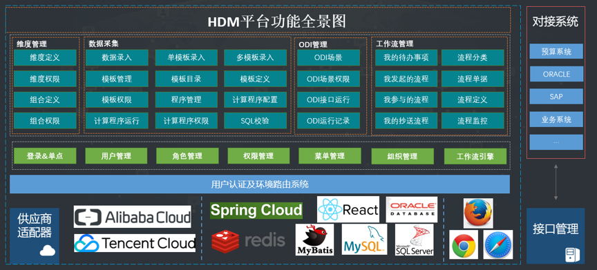
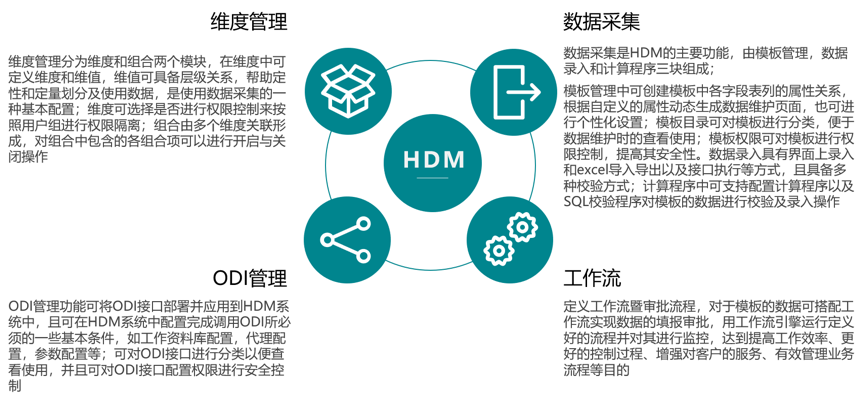
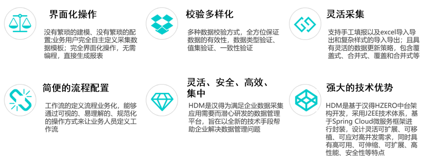

# 企业数据采集及应用信息化背景
&emsp;&emsp;在企业的发展中，数据采集及应用越来越受到企业决策和管理者的重视，尤其是近年来商务智能技术的兴起，企业在预算管理，报表合并，数据填报和清洗方面更需要专业化、精益化和快速化的利用自身数据获得商业价值。 越来越多具有规模的企业开始重视和需求一个全面的快速的支持数据采集和应用的平台来助力企业数据采集管理，加速企业价值的实现。

# 产品定位
&emsp;&emsp;汉得数据管理平台是汉得根据多年数据采集分析项目实施经验，并结合数据应用需求研发的一套企业数据采集工具，它包含**维度管理**、**数据采集**、**`ODI`管理**、**任务管理**、**系统管理**、**组织管理**、**开发管理**、**消息管理**、**调度平台**、**工作流**和**审计管理**等功能，为企业提供全方位的数据采集及应用服务。

# 产品功能

## 核心功能

# 产品特性

