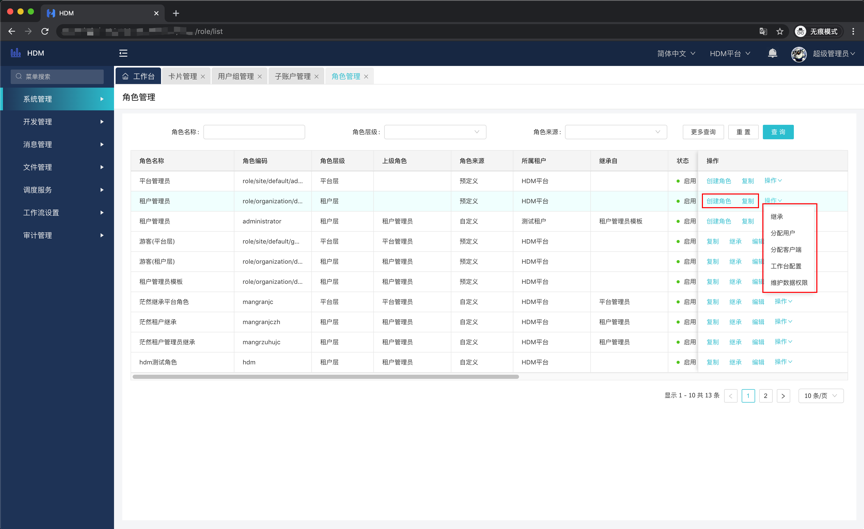
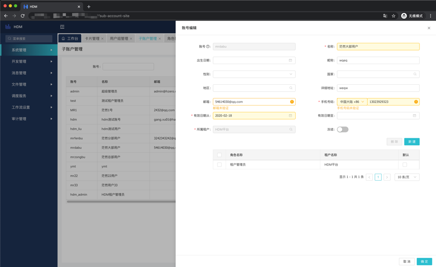

# 租户管理(平台)

## 概述

&emsp;&emsp;`HDM`是在`HZero`的基础上进行的开发，继承了`HZero`的`SASS`、`OP`属性。故`HDM`也拥有平台和租户的概念，一些功能的控制层在平台层，租户层可以狭义理解为原`HDM`的应用，他可以承担应用的角色，甚至更多，提供数据隔离，接口隔离等。平台作为总体集团监管和控制所有的租户，所以我们在实际生产中，所有的操作都是在租户层面做的，平台只起到监管作用。以下列举`HDM`中会使用到的功能做介绍，其余功能不建议放出，如若有使用需求，请移步`HZero`官网文档参考。

## 租户维护

> 入口: 系统管理-租户管理-租户维护

&emsp;&emsp;点击右上角新建，填入编码名称后即可新建一个租户。

# 角色管理

## 概述

&emsp;&emsp;角色是`HDM`中用来控制菜单和卡片权限的功能，现HDM提供角色继承的功能，即可快速完成大批量角色创建。

## 角色创建&初始化

> 入口: 系统管理-角色管理-角色管理

&emsp;&emsp;一般情况下，我们需要创建的角色都是属于某个租户的，我们可以在当前租户下创建角色，也可以在平台下创建，如图是在平台下创建角色。角色只能在对应的管理员下创建，`HDM`提供复制、继承等功能。

~~~
复制: 复制一个权限一样的角色。
继承: 继承选定的角色权限。
分配用户: 将角色分配给选定的用户。
分配客户端: 一般项目不涉及客户端操作，无须分配，只有涉及客制化多客户端开发才需要。
工作台配置: 在卡片管理维护卡片后，可以在配置处维护卡片，以便用户在工作台快捷进入某些功能或作为预览。
维护数据权限: 同分配客户端。
~~~

# 用户&用户组

## 概述

&emsp;&emsp;完成日常使用用户的创建。用户组是为了更方便用户权限分配，可以将一类用户归置一个用户组下。

## 用户创建

> 入口: 系统管理-用户管理-子账户管理

&emsp;&emsp;点击新建后输入必输项即可完成创建，如图:

~~~
账号: 登录用户名
名称: 用于显示的名称
邮箱: 维护后用于做一些提醒性的事件，比如工作流等
手机号码: 同邮箱
有效日期从: 用户开始生效日期
所属租户: 一个用户只能属于一个租户(在租户下无此选项)，此功能和用户具有的多租户权限不是一个概念，仅仅是表明该用户属于哪个租户。
角色新增: 分配所选租户角色(超级管理员可分配多租户角色)，此功能可以让用户拥有多个租户的权限。
~~~

## 用户组创建

> 入口: 系统管理-用户管理-用户组管理

&emsp;&emsp;点击新建后输入必输项即可完成创建，随后可以分配用户。

