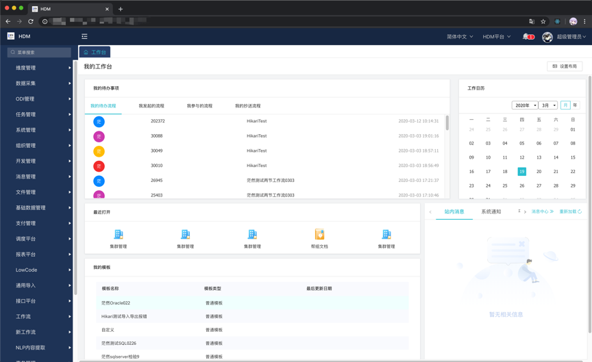
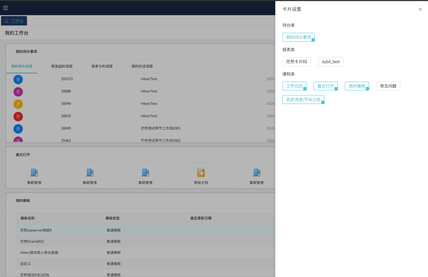

# 概述

&emsp;&emsp;HDM登录后默认会进入工作台，我们内置了很多卡片可供选择，点击便可进入对应的应用模块。

# 设置布局

&emsp;&emsp;点击右上角设置布局进入设置界面。

&emsp;&emsp;点击卡片设置可以选择展示的卡片，选择后卡片界面可以通过拖拉拽的形式展示卡片。暂时提供我的待办、工作日历、最近打开、我的模板、系统消息/平台公告的功能。其他卡片未来会继续扩展。